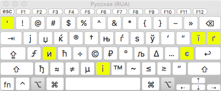

# RUA

Standard Russian keyboard layout with Urkainian symbols. Ukrainian symbols are
types with `⌥` (Option) modifier and the corresponding key in standard
Ukrainian layout.

---

Стандартная русская раскладка с добавленными украинскими символами. Для набора
украинских символов используется модификатор `⌥` (Option) и клавиша,
соответствующая нужной букве в стандартной украинской раскладке.

---

Стандартна російська розкладка з доданими українськими символами. Для набору
українських символів використовується модифікатор `⌥` (Option) і клавіша, що
відповідає потрібній літері в стандартній українській розкладці.

Download: [MacOS-RUA.dmg](https://github.com/ods/MacOS-RUA/releases/download/v2/MacOS-RUA.dmg)
